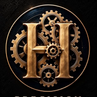
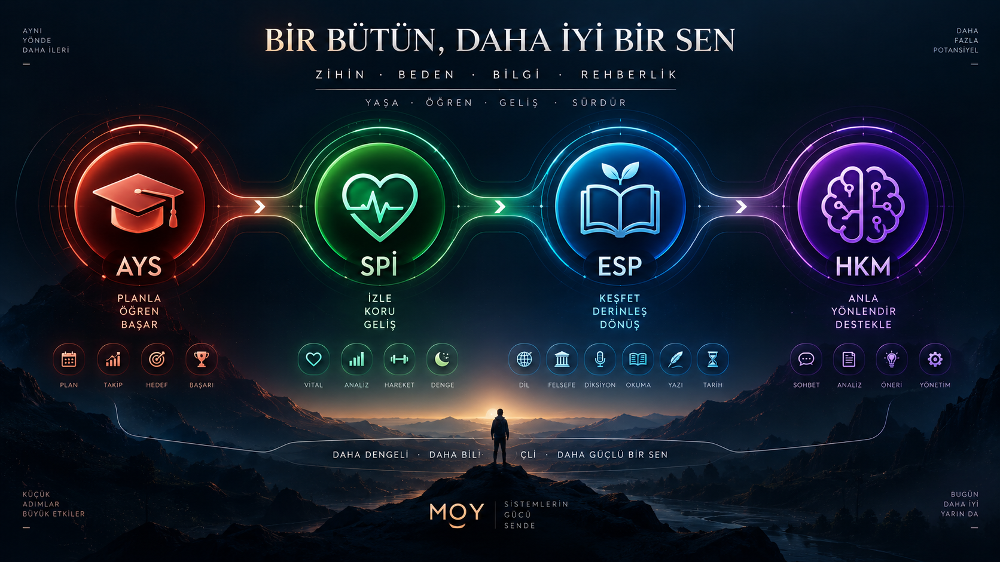

<p align="center">
  &nbsp;&nbsp;
  &nbsp;&nbsp;
  &nbsp;&nbsp;
  
</p>

<h1 align="center">LifeOS</h1>

<p align="center">
  Gündelik hayat için üç bağımsız sistem: <b>sınav</b>, <b>sağlık</b>, <b>gelişim</b>.<br/>
  Tarayıcıda çalışır, hesap istemez; verin senin bilgisayarında kalır.
</p>

<p align="center"></p>

## Başlarken

| | Ne yapılır |
|---|---|
| **Aç** | `BASLAT.bat` dosyasına çift tıkla. Tarayıcıda **kontrol paneli** açılır: <http://127.0.0.1:4180> |
| **Güncelle** | Kontrol panelindeki **Güncelle** düğmesi ya da `GUNCELLE.bat` |
| **HKM** | Kontrol panelinde HKM kartındaki **Başlat**; anahtar sorulmadan bağlanır |
| **Durdur** | `python sistem/baslat.py --dur` |

Gereken tek şey [Python 3](https://www.python.org/downloads/). macOS ve
Linux'ta: `sistem/BASLAT.command` · `sistem/baslat.sh`.

Güncelleme yalnız ileri sarar: elle değiştirilmiş bir dosya varsa hiçbir
şeye dokunmaz ve nedenini söyler. Zip ile indirilmiş bir klasörü ilk
güncellemede GitHub'a bağlar. Verin git'in dışındadır; güncelleme ona
dokunmaz.

## Dört parça

| | Sistem | Ne yapar | Adres |
|---|---|---|---|
|  | **AYS** — Akademik Yol Sistemi | Sınav hazırlığı: plan, deneme, kalibrasyon | `:4173` |
|  | **SPİ** — Sağlık Performans İzleyicisi | Uyku, beslenme, hareket, toparlanma | `:4183` |
|  | **ESP** — Entelektüel Seviye Planlayıcı | Dil, felsefe, müzik, diksiyon, okuma, yazı | `:4193` |
|  | **HKM** — Hayat Kontrol Merkezi | İsteğe bağlı merkez: günün özeti, çapraz bulgu, sohbet | `:4200` |

Üç sistem birbirini bilmez ve birbirini bozamaz. HKM üçünün **yanında**
durur: kapalıyken üçü de olduğu gibi çalışır.

## Klasör düzeni

```text
LifeOS/
├── BASLAT.bat        aç
├── GUNCELLE.bat      güncelle
├── AYS/  SPI/  ESP/  üç sistem — her biri tek başına çalışır
├── HKM/              isteğe bağlı merkez (Python servisi)
├── sistem/           başlatıcı, tek sunucu, güncelleyici
├── brand/            ortak tasarım, görseller, seviye sistemi (tek kaynak)
├── tools/            depo denetim araçları
├── belgeler/         teknik belge, raporlar, ekip notları
├── README.md         bu sayfa
└── AGENTS.md         kodlama ajanları için kurallar
```

## İlkeler

- **Sayıyı kod üretir.** Dil modeli yalnız cümleye çevirir; model kapalıyken hiçbir şey kapanmaz.
- **Eksik veri sıfır değildir.** Her sayı etiketlidir: ölçüldü · tahmin · hesaplandı · veri yok.
- **Bağımlılık yok.** Çerçeve, paket, derleyici yok; HKM yalnız Python standart kütüphanesi.
- **Sınırlar açık.** SPİ teşhis koymaz, doz önermez; AYS ve ESP sertifika vermez, sonuç garantisi etmez.
- **Karar senin.** Koçlar teklif eder; onayı sen verirsin, uygulamayı kural motoru yapar.

## Verin

Her sistemin verisi kendi tarayıcı deposunda, HKM'ninki `HKM/db/` altında
durur; ikisi de depoya girmez. Yedek almak için her sistemde **Rehber** ekranı
(ESP'de **Profil**): «Yedek al» · «Yedekten yükle».

## Daha fazlası

| | |
|---|---|
| Teknik ayrıntı (çalıştırma, telefon, sınırlar) | [`belgeler/TEKNIK.md`](belgeler/TEKNIK.md) |
| Sistem mimarileri | [AYS](AYS/src/OFIS.md) · [SPİ](SPI/src/MIMARI.md) · [ESP](ESP/src/MIMARI.md) · [HKM](HKM/MIMARI.md) |
| Geliştirme raporu ve notlar | [`belgeler/`](belgeler/) |
| Denetimler ve katkı kuralları | [`AGENTS.md`](AGENTS.md) §2 |

## Ölçülmüş sayılar

<details>
<summary>Test ve denetim sonuçları — elle yazılmaz, <code>python3 tools/sayilar.py --tam --yaz</code> üretir</summary>

<!-- SAYILAR:baslangic -->

_Bu bölüm elle yazılmaz: `python3 tools/sayilar.py --yaz` araçları koşturur ve her aracın kendi son satırını buraya yazar. Son koşum: 2026-09-25._

| Araç | AYS | SPI | ESP |
|---|---|---|---|
| `runtests.js` | 2122/2122 gecti | 1758/1758 gecti | 1743/1743 gecti |
| `smoke.js` | Duman testi temiz — 2 hedefte 44 ekran, 0 sekme gezildi. | Duman testi temiz — 2 hedefte 34 ekran, 0 sekme gezildi. | Duman testi temiz — 2 hedefte 36 ekran, 0 sekme gezildi. |
| `a11ycheck.js` | erisilebilirlik temiz (1 bilinen eksik izin listesinde) | erisilebilirlik temiz (1 bilinen eksik izin listesinde) | erisilebilirlik temiz (3 bilinen eksik izin listesinde) |
| `palettecheck.js` | 120 kontrast ölçümü AA geçti — en dar pay: ucuncul/zemin 4.61 (asgari 4.5) — light/kagit/today | 140 kontrast olcumu AA gecti — en dar pay: ucuncul/zemin 4.61 (asgari 4.5) — light/kagit/today | 160 kontrast ölçümü AA geçti — en dar pay: ucuncul/zemin 4.61 (asgari 4.5) — light/kagit/today |
| `layoutcheck.js` | Telefon ve tablet düzeni temiz — 390 ve 820 pikselde 44 yerde taşma yok, bütün dokunma hedefleri 24px ve üstü. | Telefon ve tablet düzeni temiz — 390 ve 820 pikselde 34 yerde taşma yok, bütün dokunma hedefleri 24px ve üstü. | Telefon ve tablet düzeni temiz — 390 ve 820 pikselde 36 yerde taşma yok, bütün dokunma hedefleri 24px ve üstü. |
| `perfcheck.js` | Bütün ekranlar bütçede — en ağırı office 40.6 ms (bütçe 120). | Bütün ekranlar bütçede — en ağırı office 29.6 ms (bütçe 120). | Bütün ekranlar bütçede — en ağırı office 46.7 ms (bütçe 100). |
| `ledgercheck.js` | — | 32 ekran/sekmede defter düzeni temiz | — |
| `designcheck.js` | — | 1 düzen temiz — 108 ekran/genişlik kombinasyonu bakıldı | — |
| `tasarimcheck.js` | — | 21 tasarım örneği temiz | — |
| `loadcheck.js` | yuk denetimi temiz (5 yillik veri) | yuk denetimi temiz (5 yillik veri) | yuk denetimi temiz (5 yillik veri) |

| Depo denetimi | Sonuç |
|---|---|
| `HKM tests` | 682/682 test gecti |
| `HKM perf` | Bütün sorgular bütçede. |
| `HKM yuz` | HKM yüzü temiz — 52 görünümde taşma yok, bütün hedefler 24px ve üstü, etiketler yerinde, kontrast AA. |
| `marka.py` | marka adlandirma ve yol muhafizi temiz (25 durum) |
| `marka kunyesi` | Medya kunyesi taze (43 gorsel, 4 aile). |
| `seviye.py` | Seviye sistemi: uc arayuzde de kaynakla ayni. |
| `ortak.py` | Ortak kaynak: kopyalar kaynakla ayni (83 dosya, 249 kopya). |
| `entegre.js` | Butunlesme temiz: uc arayuz de HKM ile konustu, HKM kapaliyken hicbiri bozulmadi. |
<!-- SAYILAR:bitis -->

</details>
